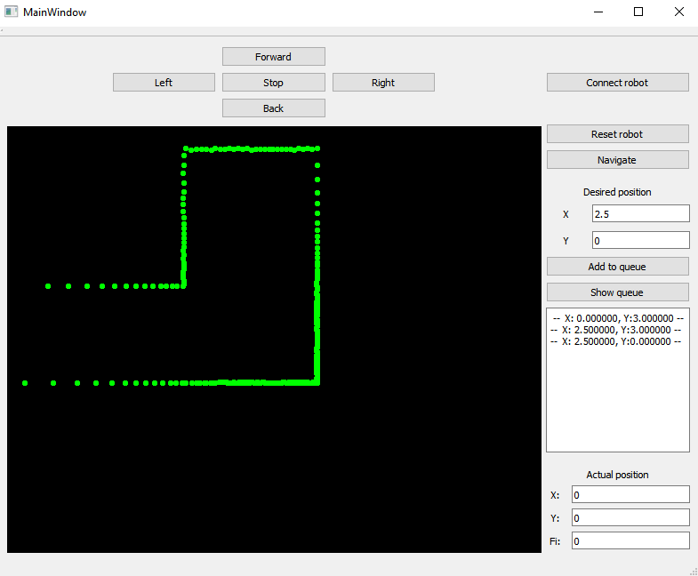
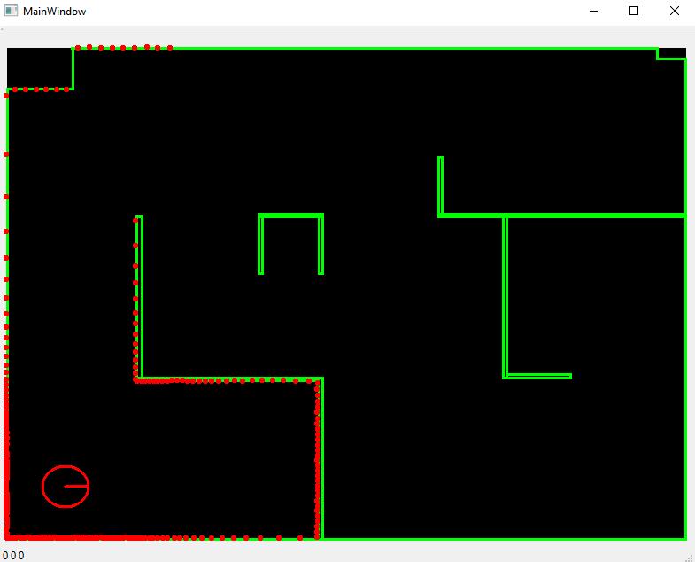

# Robot Command Tool
This is assigment for school subject Controlling mobile robots. The GUI is made in Qt.
You can control robot manually or by defining points to queue. 
There is P-regulator with ramp signal, which compute all speeds to succesfully reach target point.

