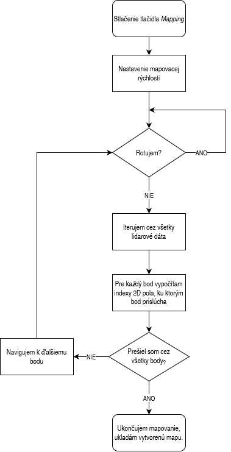

# Riadenie mobilných robotov #

Tento projekt pozostáva zo 4 úloh, ktoré sú naprogramované ako súčasť jednej aplikácie.\
Všetky úlohy sú implementované do demo príkladu, ktorý sme dostali ako podklad k predmetu.

## Úloha 1 - zadanie ##

    Prvou časťou úlohy bolo implementovanie odometrie (lokalizácie). Pozícia získaná z polohovania je 
    vztiahnutá k počiatočnej polohe robota pri jeho spustení.

    Druhou časťou úlohy bolo polohovanie. Z predošlej časti máme x,y a φ, zadáme želanú polohu ako
    Xn a Yn a budeme očakávať, že robot sa do želanej polohy dostane.

### Úloha 1 - implementácia ###

    Princíp algoritmu odometrie funguje na základe rozdielu hodnôt enkodérov kolies v aktuálnom cykle
    a v predošlom cykle. Dôležitým bodom je, že enkodér je typu beznamienkový short, ktorého maximálna
    hodnota je 65 535. Musíme ošetriť pretečenie tohto parametra - ak dosiahne maximálnu hodnotu, znova
    začne od nuly. Na základe ďalších vzorcov, ktoré máme v poskytnutých materiáloch, vieme vypočítať 
    koordináty x, y a φ. Uhol natočenia robota nepoužívam z gyra, ale rátam vlastným výpočtom.
    Druhá úloha sa týkala polohovania. Polohovanie som zabezpečil pomocou P regulátora translačnej a 
    rotačnej rýchlosti. Algoritmus je znázornený na obrázku pod týmto odstavcom. Zásobník, do ktorého
    pridávame želanú polohu, je realizovaný ako FIFO zásobník. Môžeme teda súčasne zadať naraz po sebe 
    viacero želaných bodov a robot sa bude polohovať postupne ku každému v poradí, akom boli pridané.
    Rozbeh robota pri translačnom aj rotačnom pohybe je po rampe. Tento spôsob rozbehu predchádza prešmyku
    kolies, čo by spôsobilo nepresnosť pri lokalizácii, nakoľko lokalizácia používa dáta z enkodérov a
    vyrátava podľa nich prejdenú vzdialenosť každého kolesa.

### Úloha 1 - spustenie ###

    Odometriu môže používateľ vidieť v pravej dolnej časti okna aplikácie. Ak chce používateľ využiť polohovanie,
    zadá želané súradnice do časti "Desired position" (nezabudnime, že bod [0, 0] súradnicového systému je 
    v počiatočnom bode štartu robota). Po zadaní želaného bodu stlačíme tlačidlo "Navigate" a robot sa začne 
    polohovať do zadaného bodu.

## Úloha 2 - zadanie ##

    Úlohou č.2 bolo implementovanie reaktívnej navigácie. Reaktívna navigácia má za úlohu dostať robota 
    do požadovanej polohy a vyhnúť sa kolízii s prekážkou. T.j., musí vedieť identifikovať a obísť
    prekážku, ak tá spôsobuje, že sa robot nedokáže dostať priamo do cieľa. 

### Úloha 2 - implementácia ###

    Prvou časťou riešenia problému je nájsť koncové body prekážky. To som uskutočnil pomocou Euklidovskej
    vzdialenosti a dát z lidaru. Robot po spustení navigácie zistí, či dokáže ísť priamo na prekážku,
    alebo nie. Ak nedokáže, vypočíta odchýlku uhla od robota od natočenia k cieľu. Následne na základe 
    tejto uhlovej odchýlky vypočíta percento, v ktorej časti lidarových dát sa nachádza trajektória k cieľu. 
    T.j ak rozdiel uhla medzi cieľom a robotom je 45°, percento bude 12,5 (45*100 / 360 = 12,5 ). Toto percento
    prepočítame na index lidarových dát - tento index rozdelí lidarové dáta na dve časti - ľavá časť (od natočenia k
    cieľu doĺava) a pravá časť (od natočenia k cieľu doprava). Ľavá časť iteruje lidarové body od indexu
    inkrementálne po koniec poľa. Pravá časť iteruje od indexu dekrementálne po začiatok poľa. (1. obrázok)
    V týchto iteráciach hľadáme bod, v ktorom sa skokovo zmení vzdialenosť. Ak to nastane, vieme, že sme
    detegovali hranu prekážky. Nevieme však, či naša najbližšia hrana je prvok 'k' alebo 'k-1' (rep. k+1)
    pri iterácii pravou stranou. Preto označíme oba body za prekážku a v neskoršej fáze vyberieme ten bod,
    cez ktorý má robot kratšiu dráhu do cieľa. Pre nájdený bod vypočítame bezpečnostný offset. Využívame 
    pri tom goniometrické vzťahy. Keď sa robot dostane do tohto bodu, opakuje sa celý algoritmus opísaný 
    vyššie. Ak je už možné dosiahnuť cieľ priamo, robot automaticky prepne režim hľadania prekážky do 
    režimu priamej navigácie. Či je bod dosiahnuteľný alebo nie, zisťujem pomocou algoritmu zóny, ktorý 
    máme znázornený v učebných dokumentoch. Algoritmus je znázornený na 2. obrázku pod týmto odstavcom.

### Úloha 2 - spustenie ###

    Zadáme súradnice želaného bodu v časti "Desired position". Z módu "Plan P reg" musíme prekliknúť možnosť
    "Reactive nav". Stlačíme tlačidlo "Navigate" a robot sa začne pohybovať do cieľa - zároveň obchádza 
    prekážky.
  

## Úloha 3 - zadanie ##

    Úlohou č.3 bolo implementovanie mapovania prostredia. Robot musí vedieť zmapovať prostredie v ktorom sa 
    sme pohybovať. Mapa bude slúžiť v 4. úlohe na navigáciu robota podľa mapy prostredia. Priestor, ktorý 
    mapujeme, má rozmery zhruba 6x6 metrov.

### Úloha 3 - implementácia ###

    Mapu priestoru reprezentujem ako 2D pole integerov. Keďže neviem počiatočnú polohu robota vo vymedzenom
    priestore, zvolil som si také rozmery poľa, aby boli postačujúce pre akúkoľvek počiatočnú polohu robota.
    Zvolil som rozmer 12x12. V tomto prípade by predstavoval jeden skok medzi bunkami rozmer 1 meter. Ak
    chceme rozlíšenie menšie, potrebujeme pole zväčšiť. Zvolil som si krok približne 8 cm, čo pole 12x12
    zväčší na 144x144 (12m / 144b = 0.0833). Keď už máme formát reprezentovania mapy prostredia, môžeme
    začať s mapovaním. V každom kroku robota zoberieme súbor dát z lidaru a pre každý bod určíme koordináty
    [x, y]. Následne tieto koordináty prepočítame na indexy 2D poľa (berieme v úvahu, že máme väčšie pole
    z dôvodu, že nevieme kde začneme - takže bod [0, 0] leží v strede 2D poľa). Každý bod lidaru je v mape 
    následne reprezentovaný ako číslo 1. Dôležitý bod je, že nemapujeme, ak je robot v rotácii. Pri rotácii
    dochádza k veľmi veľkým nepresnostiam a skresľovalo by to našu mapu. Aby sme zmapovali celé prostredie, 
    naplníme si zásobník takými bodmi v priestore, aby robot zmapoval všetky časti oblasti. 
    Použijeme polohovanie k tomu, aby sa robot dostal ku každému bodu (body som rozvrhol tak, že robot nemusí
    obchádzať prekážky a teda používať reaktívnu navigáciu). Zároveň, aby nevznikali zbytočné nepresnosti, 
    maximálna rýchlosť robota pri mapovacom móde sa zníži, nakoľko pri nižšej rýchlosti robota sú nepresnosti
    menšie. Algoritmus je znázornený na obrázku pod týmto odstavcom.

### Úloha 3 - spustenie ###

    Pre spustenie mapovania použijeme tlačidlo "Map". Robot má vo svojom algoritme preddefinované
    body, cez ktoré ma pomocou regulátora prejsť tak, aby zmapoval všetky časti priestoru. Po stlačení
    tlačidla sa naplní zásobník žiadaných bodov preddefinovanými bodmi a žačne s polohovaním a mapovaním.
    Po dosiahnutí všetkých bodov v zásobníku robot automaticky ukončí mapovací mód a automaticky uloží mapu
    prostredia do súboru "map.txt". 
  

## Úloha 4 - zadanie ##

    Úlohou č.4 bolo implementovanie navigácie pomocou mapy prostredia. Úloha priamo nadväzuje na predchádzajúcu
    úlohu mapovania. Úlohou bude dostať sa do ľubovoľného bodu prostredia so schopnosťou vyhnúť sa prekážke. 

### Úloha 4 - implementácia ###

    Máme mapu prostredia z predošlej úlohy. Prvým krokom je rozšírenie stien v mape, aby sme zabezpečili, že
    robot nenarazí do žiadnej z nich (robot má určitý polomer, s ktorým sme pri mapovaní neuvažovali). Keďže
    máme krok medzi bunkami ~8cm, budeme musieť steny rozšíriť o 2 bunky na každú stranu. Tým zabezpečíme, že
    stena bude zhrubnutá o ~16 cm, čo je viac ako polomer robota. Ďalej pokračujeme presne podľa postupu v
    poskytnutých učebných materiáloch. Zvolili sme si pohyb iba v 4 smeroch, teda 4-susednosť. Najskôr pomocou
    záplavového algoritmu určíme vzdialenosti všetkých buniek v priestore od cieľa. Ciel reprezentuje číslo 2
    v 2D poli, každá susedná bunka je repzrezentovaná inkrementom predchodzej bunky smerom k cieľu. Ciel je 
    reprezentovaný ako 0. Zaplavujeme 2D pole týmito vzdialenosťami len v rozpätí stien priestoru. Keď narazíme 
    na bunku s hodnotou 1 (stena), ďalej nepokračujeme a ideme iným smerom.
    Záplavový algoritmus je implementovaný pomocou queue. Funguje na princípe algoritmu "Breadth First Search".
    Keď máme takto zaplavený priestor vzdialenosťami, použijeme opäť queue nato, aby sme našli najkratšiu vzdia-
    lenosť od polohy robota po ciel. Jedná sa o rovnaký algoritmus ako v predošlej úlohe, začíname však opačne,
    teda nie v cieli ale v štarte. Následne ideme do tej susednej bunky, ktorá má najmenšiu hodnotu. Túto bunku 
    označíme číslom 0. Takto pokračujeme, až sa dostaneme do ciela. Pri celom tomto procese si zaznačujeme, 
    do ktorého smeru sused aktuálnej bunky má najmenšiu vzdialenosť a rovnako si držíme predošlého suseda.
    Ak sa sused zmení (t.j. zmení sa smer z vertikálneho na horizontálny alebo opačne) vieme, že je to zlomový bod.
    Pre tento bod si prepočítame súradnice do súradného systému sveta a vložíme tento bod do zásobníka. Takto
    vložíme do zásobníka všetky body, kde dochádza k zmene smeru, až pokým sa nedostaneme k cieľu. Algoritmus je 
    znázornený na obrázku pod týmto odstavcom.

### Úloha 4 - spustenie ###

    V prvom rade musíme mať v build priečniku mapu priestoru vo formáte .txt súboru (map.txt). Ak takú nemáme,
    použijeme najskôr mód mapovania (úloha 3).
    Spustenie navigovania pomocou mapovania je rovnaké ako pri jednoduchej aj reaktívnej navigácii. Jediná zmena
    je prepnutie režimu navigácie na "Mapping nav". 

